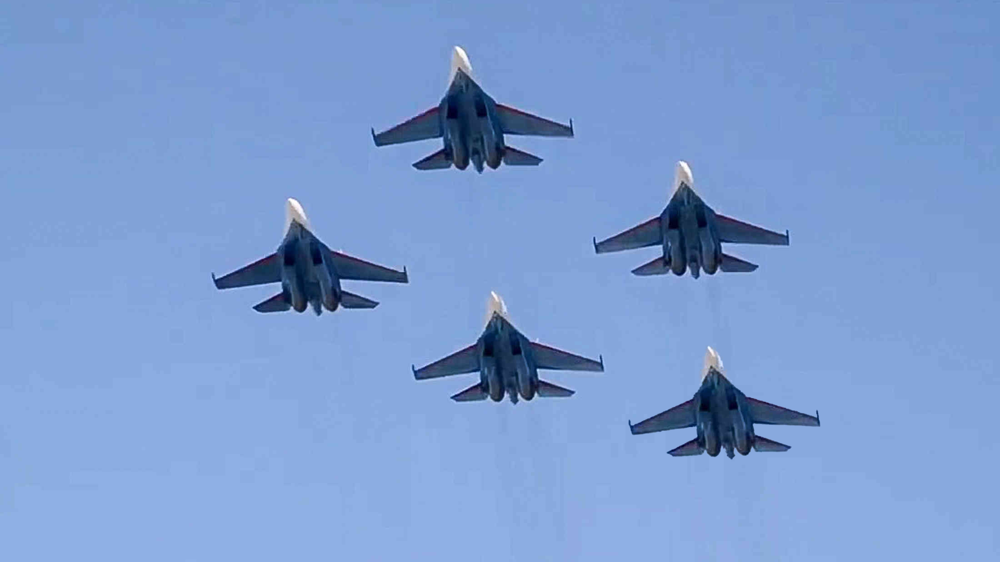
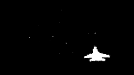

## Search for changes to a Jpeg image. This script allows you to find out if any objects were added to the image after the picture was taken.
### Paper: Weihai Li et al. "Passive detection of doctored JPEG image via block artifact grid extraction"

### Original:

### Output:

